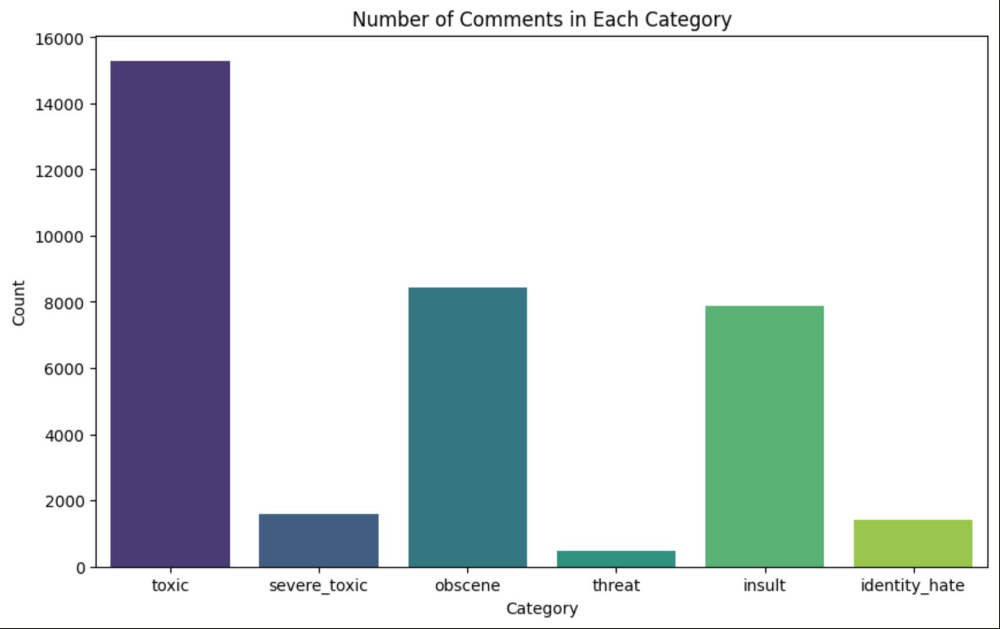
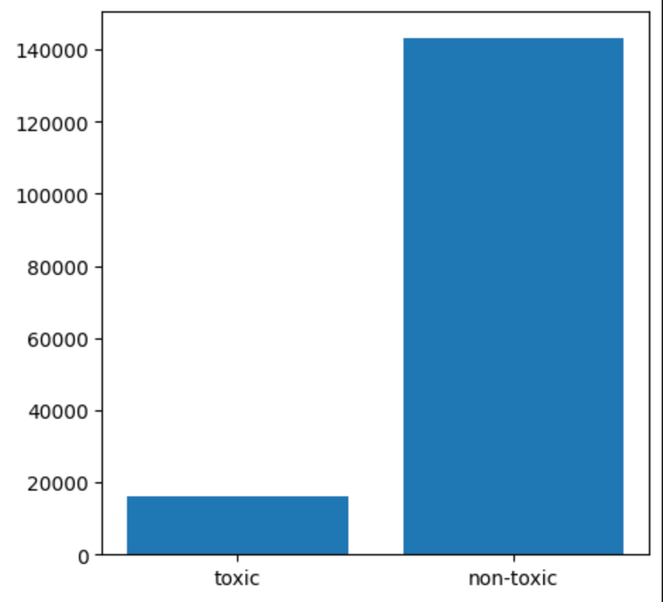

# Toxic Comments Classification

A machine learning project that classifies comments into various categories of toxicity using both traditional and deep learning approaches.

## Project Overview

This project tackles the challenge of content moderation by building models to automatically classify comments into multiple toxicity categories: **toxic**, **severe toxic**, **obscene**, **threat**, **insult**, and **identity hate**. This is a multi-label classification problem where a single comment can belong to multiple categories.

## Objectives

- Build a baseline logistic regression model for toxic comment classification
- Develop a deep learning model using DistilBERT as the base architecture
- Compare model performance and conduct error analysis
- Address data imbalance and preprocessing challenges

## Dataset

The project uses the **Jigsaw Toxic Comment Classification Dataset** (available on HuggingFace: `tcapelle/jigsaw-toxic-comment-classification-challenge`):

- **Source**: Wikipedia talk page comments
- **Size**: 172,057 total comments
- **Features**: 6 toxicity categories (binary labels)
- **Challenge**: Highly imbalanced dataset with significantly more non-toxic comments
  

*Figure 1: Distribution of labels*

*Figure 2: Imbalance in toxic and non toxic comments*

### Dataset Statistics
- Maximum comment length: 2,321 words
- Minimum comment length: 1 word  
- Average comment length: 485 words
- Balanced subset used: 15,000 toxic + 15,000 non-toxic comments

## Models Implemented

### 1. Baseline Model: Logistic Regression
- **Approach**: One-vs-Rest classification for multi-label prediction
- **Features**: TF-IDF vectorization with uni-grams and bi-grams
- **Preprocessing**: Lowercase conversion, special character removal, stopword removal
- **Performance**: ROC-AUC = 0.71

### 2. Deep Learning Model: DistilBERT
- **Base Model**: `distilbert-base-cased`
- **Architecture**: DistilBERT + Classification layer + Dropout
- **Loss Function**: BCEWithLogitsLoss
- **Optimizer**: AdamW
- **Performance**: ROC-AUC = 0.94

## Results

| Model | ROC-AUC | Micro Avg Recall | Micro Avg F1 |
|-------|---------|------------------|--------------|
| Logistic Regression | 0.71 | 0.69 | 0.76 |
| DistilBERT | 0.94 | 0.82 | 0.80 |

### Detailed Performance Metrics

**DistilBERT Model Performance by Category:**
- Toxic: Recall 0.93, F1 0.89
- Severe Toxic: Recall 0.53, F1 0.40
- Obscene: Recall 0.80, F1 0.80
- Threat: Recall 0.57, F1 0.58
- Insult: Recall 0.75, F1 0.75
- Identity Hate: Recall 0.55, F1 0.62

### Hardware Requirements
- GPU used for DistilBERT training
- Training time: ~32 minutes (5 epochs on MPS GPU)

## 🔍 Error Analysis

### Model Strengths
- **DistilBERT** successfully identifies:
  - Comments with spelling errors ("U r such a looooser")
  - Sarcastic toxic comments with emojis ("wow you're such a genius! XD")

### Model Limitations & Bias
Both models show bias toward certain demographics, incorrectly classifying neutral comments as toxic:
- "Are you a muslim?"
- "She is a black woman."
- "I am a proud gay man."

This highlights the importance of bias detection and mitigation in NLP models.

## Key Insights

1. **Preprocessing Impact**: Dataset balancing and text cleaning significantly improve performance
2. **Model Architecture**: DistilBERT's contextual understanding vastly outperforms traditional approaches
3. **Case Sensitivity**: Using cased models helps detect uppercase emphasis in toxic language
4. **Bias Awareness**: Models inherit biases from training data, requiring careful evaluation

## Future Improvements

- **Multilingual Support**: Extend classification to multiple languages
- **Data Augmentation**: Advanced techniques to improve minority class representation
- **Bias Mitigation**: Implement fairness-aware training techniques
- **Real-time Deployment**: Optimize for production environments

## Important Notes
This model is intended for research and content moderation purposes

## 📄 License

This project is open source and available under the [MIT License](LICENSE).

## 📚 References

- Brassard-Gourdeau, E. and Khoury, R. (2019). Subversive toxicity detection using sentiment information.
- Davidson, T., et al. (2017). Automated hate speech detection and the problem of offensive language.
- Kiilu, K. K., et al. (2018). Using naïve bayes algorithm in detection of hate tweets.
